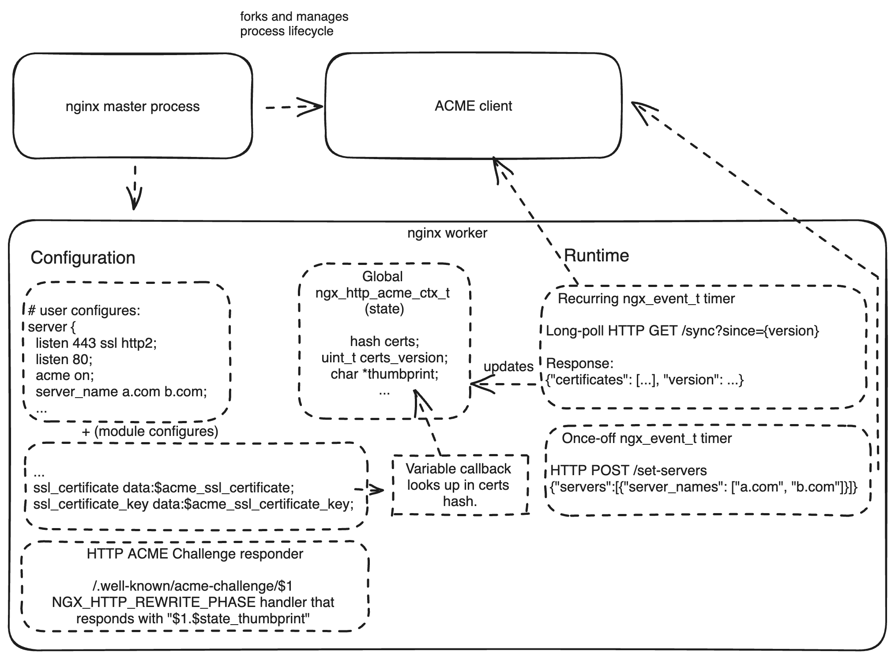

# ngx-acme-poc

This is an experimental proof-of-concept for an ACME (RFC8555) dynamic module for nginx. Its purpose is
to automatically obtain and renew SSL certificates for HTTP servers.

Nearly every decision taken in this project was made expeditiously, not because it was the right decision. Determining whether it was going to work at all was the goal. See the design discussion at the bottom of this document.

## How it works

The project includes two components:

### 1. The nginx module
The nginx module is written in C and can be found at `src/ngx_http_acme_module.c`.

Its functions:

1. To dynamically resolve and use SSL certificates. It does this by setting a server's `ssl_certificate{,_key}` to the complex value (a.k.a variable)`data:$acme_certificate{_key}` (nginx 1.15.10+). The module then implements a runtime "get" hook for these variables, where it is able to dynamically choose a certificate to use, in the scope of an HTTP connection.

2. To launch an external ACME client. To avoid writing too much unsafe C code and to avoid highly duplicative work between nginx workers (where coordination would be a nightmare), all actual ACME client responsibilities are delegated to an external process. The nginx master process should fork this process upon launch, and worker processes interface with it via a simple HTTP API (TCP or UNIX socket, not determined).

3. To communicate with the external ACME client. 

    i. The nginx workers need to inform the ACME client of what the `server` list looks like, and what the expected certificate SANs are (combination of `server_name` and perhaps `acme_*` directives). 

    ii. The nginx workers use long-polling to receive certificate updates from the ACME client. This is a low-overhead method of communication that embeds well into the nginx event loop, and allows the ACME client to push state updates as they become available.

4. To respond to ACME HTTP challenges. Provisionally, the module will be aware of the ACME account's thumbprint, and will use a response to directly respond to ACME HTTP challenge requests. DNS challenges will be delegated to the ACME client entirely, but TLS-ALPN challenges may not be possible to implement with how nginx works today. 

### 2. The ACME client
There is an example ACME client that conforms to the design of the nginx module in `dummy-acme-client/main.go`.

Its important functions are:

1. Implement certificate acquisition, storage and renewal strategy for whatever the `server` list reported by the nginx workers is.
2. Provide a simple HTTP long-polling endpoint for nginx workers to receive certificate updates (as well as informing nginx workers of details of challenges, like key authorization strings/thumbprints).
3. Provide a simple HTTP endpoint for nginx workers to update the ACME client on the current `server` list. 

## Building
At the moment, there is a `Makefile` which is specific to my local environment. Making this portable to other environments will just involve documenting how to check out an nginx source distribution (be it from nginx.org or a Linux source deb/rpm or Homebrew) and how to use that source distribution to build the dynamic ACME module.

## Status
This is an experiment to see whether nginx's design is amenable to this kind of module and whether the module can be implemented in a way that meets the  goal of "let's do away with Certbot".

Currently, the following is implemented:

- [ ] ACME client
  - [x] Account registration
  - [x] Obtaining certificates
  - [ ] Retrying failed orders
  - [ ] Renewing certificates
  - [x] Pushing updates to workers
  - [x] Receiving worker configuration
- [ ] nginx module
  - [ ] nginx master process launches ACME client
  - [x] ACME HTTP challenge response
  - [x] Pushes config to ACME client
  - [x] Recurringly pulls certificates from ACME client
  - [x] Dynamically uses certificates from ACME client
  - [ ] Handles reloads.
  - [ ] Allows configuring the ACME client via `acme_*` directives.
- [ ] Build
  - [ ] `Makefile` anyone can use
  - [ ] Build dynamic module binaries against nginx.org source distributions
  - [ ] Build dynamic module binaries against Debian/Ubuntu/EPEL source distributions.

## Design Discussion

- **Avoiding an external ACME client**

  The ACME client is an external process because:

  1. It can be written in a memory safe language
  2. It doesn't need to care about the nginx event loop
  3. It can take advantage of a mature ACME ecosystem of language XYZ (libraries, DNS plugins, etc).
  4. Easier and faster to develop.

  Plausibly, the nginx module could instead implement the ACME client itself. This would avoid having the ACME client as a sidecar process and the communication overhead that comes with it.

  Significantly, this would need to be done in a way that does not block the nginx event loop, doesn't use threads, and is coordinated between nginx workers.

  The runtime state of the ACME client could be stored
  in an `ngx_shm_zone_t` with synchronized access. Workers could (randomly, staggered) try to obtain a lock on the client and perform the ACME client's work within the nginx event loop.

  Life would be hard, but not impossible.

- **Avoiding C: write it in Rust**

  [Cloudflare's blog post](https://blog.cloudflare.com/rust-nginx-module/) suggests that writing nginx modules in Rust is possible. In my short time experimenting with [nginxinc/ngx-rust](https://github.com/nginxinc/ngx-rust), this experience leaves much to be desired. If using the Rust bindings results in essentially writing C code in Rust (constant `unsafe` FFI), the benefit is less obvious. Contributing to or waiting for the Rust bindings to mature may be needed for this to be a serious option.

  With a working C prototype, rewriting this in Rust may be less miserable on a second attempt.

- **Avoiding C: write some of it in Rust**

  One less ambitious approach could be to write parts of the module in Rust, to be called from C. 

  For example, all of the JSON and HTTP request parsing in the module is written in C and is probably unsafe in ways that are hard to detect. Offloading all of this to Rust code would be a good start.

  This approach would still result in much non-boilerplate C code (or "the Rust equivalent of C code"), owing to the fact that we still need to work within nginx's event loop and approach to networking and i/o. With care, this could be minimized and easier to audit.

  Doing this would also make implementing the ACME client within the module itself a much more reasonable prospect.